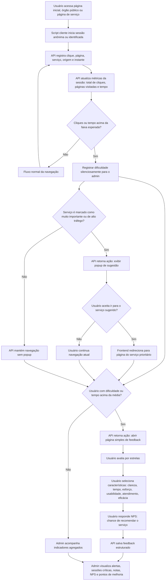

# Fluxograma: avaliador de serviços públicos

Este fluxograma descreve a proposta atual do TCC: criar um mecanismo próprio para ambientes públicos digitais, em vez de adaptar diretamente um sistema já existente no mercado.

## Decisões do fluxo

- O registro de cliques é contínuo e silencioso.
- Quando a faixa esperada é ultrapassada, a API registra uma dificuldade para análise administrativa.
- Para serviços comuns, a navegação continua sem interrupção.
- Para serviços de alto tráfego ou alta importância, a API retorna uma ação para o frontend exibir um popup de direcionamento.
- Para usuários com sinais de dificuldade, a API retorna uma ação para abrir uma página simples de feedback.
- O feedback combina três entradas: estrelas, características do problema e NPS.
